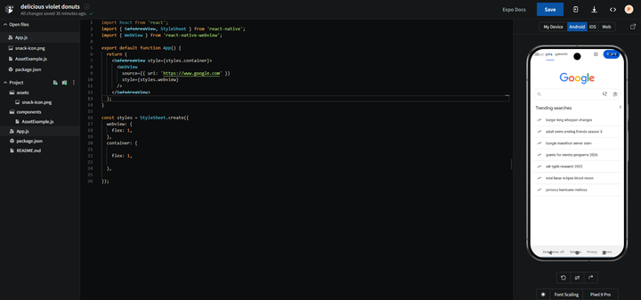
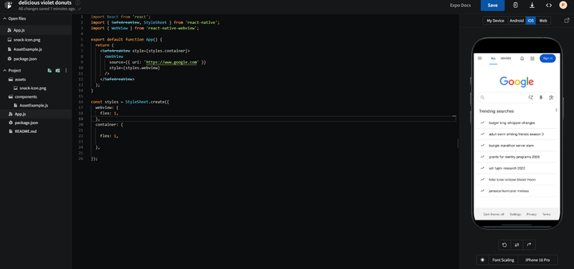

# Search Shell Hybrid App

This project implements a Hybrid Search Application using React Native and Expo.  
The app works as a native shell that loads Google Search inside a WebView.

## Technologies
- React Native
- Expo
- react-native-webview

## App Screenshot

### Android

### iOS

## How it works
The application uses a SafeAreaView as a container and loads https://www.google.com inside a WebView component that fills the entire screen.

## Technical Reflection

This application is classified as a Hybrid/Shell architecture because the user interface is rendered entirely from the web content within a WebView. React Native acts solely as a native container hosting the webpage. In contrast, a native/bridged UI architecture renders the interface using native components that communicate via the React Native bridge.